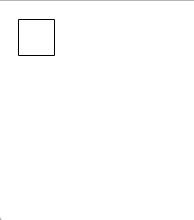
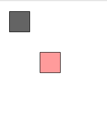
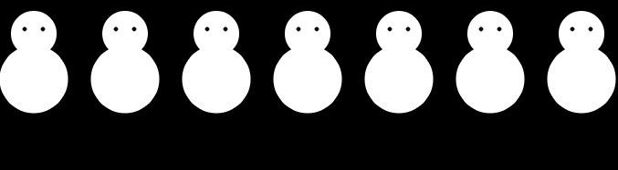
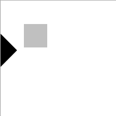
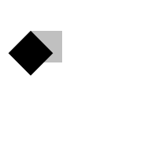
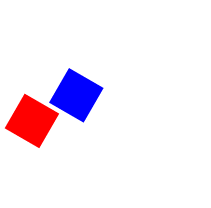

#2D Tranformations in p5.js

This tutorial is an alternative version of the processing tutorial,  [2D Transformations by J. David Eisenberg] (https://processing.org/tutorials/transform2d/), adapted for p5.js.

##Translation: Moving the Grid

As you probably know, p5.js sketches work like sketching on graph paper. When you want to draw something, like an ellipse or rectangle, you specify it's coordinates. Here's a simple rectangle drawn with the following code:

``` javascript
rect(20, 20, 40, 40);

```


If you want to move the rectangle 60 units right and 80 units down, you _can_ change the coordinates, by adding to the _x_ and _y_ starting point:

``` javascript

fill(255, 0, 0, 100);
rect(20 + 60, 20 + 80, 40, 40);

```


Here, you can see the original rectangle in gray and it's twin in red.

Indeed, the rectangle will appear in a different place, but there is a more interesting way to solve this problem-- **move the graph paper instead**. If we move the _graph paper_ 60 units right and 80 units down, you'll get exactly the same visual result. We call moving the coordinate system _translation_ and you can do it using the `translate()` function that comes with p5. Here we've drawn another rectangle using `translate()` in green.

``` javascript

fill(0, 255, 0, 100);
translate(60, 80);
rect(20, 20, 40, 40);

```


You can tell the two rectangles are in the same spot because of that weird tan color you get by mixing red and green, haha!

The important thing to notice, however, is that as far as the green rectangle is concerned, it hasn't moved. It's upper left corner is _still_ at (20, 20)! It's the point (20, 20) *itself* which has moved, along with the rest of the coordinate system in your sketch. All the things you draw after calling `translate(60, 80)` will behave as if the origin (which is usually at the top left hand corner of the screen) has moved to (60, 80).

Here's code that draws the rectangle in red by changing the coordinates, then draws in blue through translation. The rectangles have been drawn with alpha 100 so that you can clearly see the colors mixing to indicate the rectangles are **visually** at the same spot. The only thing that has changed about them is the method used to move them. Copy this code into your p5.js editor and give it a whirl!


``` javascript

function setup(){
  createCanvas(200, 200);
  background(255);
  noStroke();

  // draw the original position of the rect in gray
  fill(200);
  rect(20, 20, 40, 40);

  // draw a translucent red rect by changing the coordinates
  fill(255, 0, 0, 100);
  rect(20 + 60, 20 + 80, 40, 40);

  // draw a translucent blue rect by shifting
  // (translating) the coordinate system

  fill(0, 0, 255, 100);
  translate(60, 80);
  rect(20, 20, 40, 40);

  // realize that we've just translated the
  // *entire* grid!-- drawing an ellipse at (0,0)
  // doesn't draw it in the top left corner anymore!

  ellipse(0, 0, 50, 50);


  // but if we translate the grid again
  // the circle will appear back where we
  // asked it to be...? right?

  fill(255, 0, 0, 100);
  translate(0, 0);
  ellipse(0, 0, 50, 50);

	// wrong! unfortunately for us, by using translate() we've
	// already redefined the point (0, 0) to be (60, 80)
	// earlier in our code. so, if we try to put the grid
	// back at (0, 0), it won't do anything because the
	// computer thinks (0, 0) = (60, 80)!
}

```

##Translation, Properly

One problem you might run into using `translate()` is that, eventually, you may want to put the coordinate grid back where it was originally. In this case, two lovely functions arrive to save the day. Their names are `push()` and `pop()` and they'll help us save and restore our _drawing states_.

The **drawing state** is created when you store information about the way you've created your sketch for use later. `push()` saves data about the _style_ settings controlled by the following functions:

+ fill()
+ stroke()
+ tint()
+ strokeWeight()
+ strokeCap()
+ strokeJoin()
+ imageMode()
+ rectMode()
+ ellipseMode()
+ colorMode()
+ textAlign()
+ textFont()
+ textMode()
+ textSize()
+ textLeading()

It also saves data about the current transformation state, which is exactly what we need to continue. To revert to our saved drawing state, all we have to do is call the `pop()` function.

Here's code that draws a gray circle at the origin, a _translated_ green one 80 units right and 60 units down, a blue square at the "new" origin, and a blue square at the actual origin. Copy this code into your p5.js editor and give it a whirl!

``` javascript

function setup() {
	createCanvas(200, 200);

	// draw a gray circle at the origin
	fill(100);
	ellipse(0, 0, 60, 60);

	// save the current coordinate system so we can get it back later
	push()

	// translate the grid and draw the same circle, translated in green
	translate(80, 60);
	fill(0, 255, 0, 100);
	ellipse(0, 0, 60, 60);

	// try drawing a blue square at the origin
	fill(0, 0, 255, 100);
	rect(0, 0, 50, 50);

	// unfortunately, that did not work
	// let's try using pop() to get back our saved coordinate system
	pop();
	fill(0, 0, 255, 100); // ?
	rect(0, 0, 50, 50);

	// success!

	// * try commenting out the line marked with a ? in the last section
	// * you'll see pop() even reverted the fill of the square to gray
	// * the color of the circle we drew before calling push()!

}

```

##Why do all this?

Great, translating works properly! But, why would anyone do it over just adding to the coordinates like this?

``` javascript

rect(20 + 60, 20 + 80, 40, 40);

```

You may also be thinking that picking up the coordinate system and moving it is a lot more trouble than it's worth, when you can just add to coordinates. For a simple example like the rectangle, you're right. But what if we want to move an _entire row_ of, uh, snowman?

``` javascript

for (var i = 10; i < 350; i = i + 50){
		drawSnowman(2 * i, 20);
}

```

This is the code for drawing an army of snowman by changing their position. Look at all the additions we have to keep track of!

``` javascript
function drawSnowman(x, y) {

	//draw the body
	fill(255)
	ellipse(20 + x, 20 + y, 50, 50);
	ellipse(20 + x, 70 + y, 75, 75);

	//draw the eyes
	fill(0)
	ellipse(10 + x, 15 + y, 5, 5);
	ellipse(30 + x, 15 + y, 5, 5);

}
```

Compare that to the version of the function that uses `translate()`. In this case, the code draws each snowman in the same place every time. with it's upper left corner at (0,0), and lets translation do all the work instead.


``` javascript

function drawSnowman(x, y) {
	push();
	translate(x, y);

	//draw the body
	fill(255)
	ellipse(20, 20, 50, 50);
	ellipse(20, 70, 75, 75);

	//draw the eyes
	fill(0)
	ellipse(10, 15, 5, 5);
	ellipse(30, 15, 5, 5);

	pop();
}

```



##Rotation

Not only can we move the coordinate system with `translate()` in p5, we can also rotate the entire grid, with `rotate()`. This function takes one argument, which is the number of _radians_ you want to rotate. Since most people think in degrees, p5 has a built-in `radians()` function which takes a number of degrees as it's argument and converts it for you. Give that background info, let's try rotating a square clockwise.

``` javascript

function setup(){
  createCanvas(200, 200);
  background(255);
  noStroke();

  // draw rect in gray
  fill(192);
  rect(40, 40, 40, 40);

	// save drawing state for later
	push();

	// rotate by 45 degrees
	rotate(radians(45));

	// draw rotated rect in black
	fill(0);
	rect(40, 40, 40, 40)

	//revert to original drawing state
	pop();
}

```



Hey, what happened? How come the square got moved and cut off? The answer is: the square did not move. The **grid** was rotated and on the rotated coordinate system, the square still has its upper left corner at (40, 40).

##Rotation, Properly

The correct way to rotate the square would be to:
+	Translate the coordinate system’s origin (0, 0) to where you want the upper left of the square to be.
+	Rotate the grid π/4 radians (45°)
+ Draw the square at the origin.

And here is the correct code and its result.

``` javascript

function setup(){
  createCanvas(200, 200);
  background(255);
  noStroke();

  // draw rect in gray
  fill(192);
  rect(40, 40, 40, 40);

	// save drawing state for later
	push();

	// move the origin to the pivot point
	translate(40, 40);

	// then pivot the grid
	rotate(radians(45));

	// draw rect in black at the new origin
	fill(0);
	rect(0, 0, 40, 40)

	//revert to original drawing state
	pop();
}

```




Here is a program that generates a wheel of colors by using rotation! <3

``` javascript

function setup() {
  createCanvas(200, 200);
  background(255);
  smooth();
  noStroke();
}

function draw(){
  if (frameCount % 10 == 0) {
    fill(frameCount * 3 % 255, frameCount * 5 % 255,
      frameCount * 7 % 255);
    push();
    translate(100, 100);
    rotate(radians(frameCount * 2  % 360));
    rect(0, 0, 80, 20);
    pop();
  }
}

```


## Scaling

The final coordinate system transformation is scaling, which changes the size of the grid. Take a look at this example, which draws a square, then scales the grid to twice its normal size, and draws it again.

``` javascript
function setup() {
  createCanvas(200,200);
  background(255);
  noFill();

  // draw a 40x40 square in gray
  stroke(128);
  rect(20, 20, 40, 40);

  // change the stroke color to gray
  stroke(0);

  // save the current drawing state for later
  push();

  // stretch the grid so it's twice as big
  scale(2.0);

  // draw a 40x40 square in black on this stretched out grid
  rect(20, 20, 40, 40);

  pop();
}

```

First, you can see that the square appears to have moved. It hasn’t, of course. Its upper left corner is still at (20, 20) on the scaled-up grid, but that point is now twice as far away from the origin as it was in the original coordinate system. You can also see that the lines are thicker. That’s no optical illusion—the lines really are twice as thick, because the coordinate system has been scaled to double its size.

#Order Matters

When you do multiple transformations, the order makes a difference. A rotation followed by a translate followed by a scale will not give the same results as a translate followed by a rotate by a scale. Here is some sample code and the results.

``` javascript

function setup() {
  createCanvas(200, 200);
  background(255);
  noStroke();
  smooth();

  // draw axes
  line(0, 0, 200, 0);
  line(0, 0, 0, 200);

  // save drawing state for later
  push();

  // rotate the grid
  rotate(radians(30));

  // move the grid 70 units right and 70 down
  translate(70, 70);

  // stretch the grid to be twice as big
  scale(2.0);

  // draw a red square at the origin
  fill(255, 0, 0);
  rect(0, 0, 20, 20);

  // revert to saved drawing state
  pop();

	// move the grid 70 units right and 70 down
  translate(70, 70);

  // rotate the grid
  rotate(radians(30));
  // stretch the grid to be twice as big
  scale(2.0);

  // draw a blue square at the origin
  fill(0, 0, 255);
  rect(0, 0, 20, 20);

  // revert to saved drawing state
  pop();
}

```



#Before we go...

##Push and Pop

What exactly are _push_ and _pop_ supposed to mean? These come from a computer concept known as a stack, which works like a spring-loaded tray dispenser in a cafeteria. When someone returns a tray to the stack, its weight pushes the platform down. When someone needs a tray, she takes it from the top of the stack, and the remaining trays pop up a little bit.

In a similar manner, push() puts the current status of the coordinate system at the top of a memory area, and pop() pulls that status back out.

##Three-dimensional Transforms
If you are working in three dimensions, you can call the translate() function with three arguments for the x, y, and z distances. Similarly, you can call scale() with three arguments that tell how much you want the grid scaled in each of those dimensions.
For rotation, call the rotateX(), rotateY(), or rotateZ() function to rotate around each of the axes. All three of these functions expect one argument: the number of radians to rotate.


#####Notices

The original Processing tutorial has some extra parts to pratice these topics, namely two case studies on animating things and making interactive transformations. I encourage you to use them, but please know that in Processing, `push()` and `pop` are referred to as `pushMatrix()` and `popMatrix`.

Happy learning! <3
